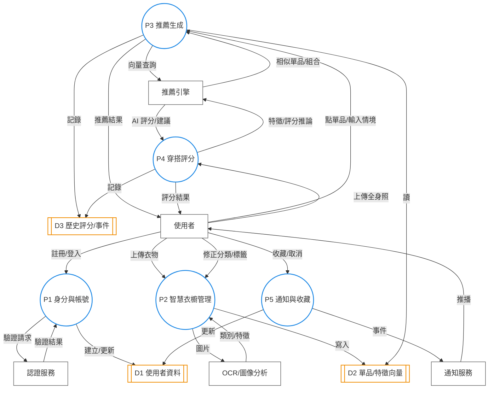

# 系統環境圖 (DFD)

# DFD 圖0

```mermaid
flowchart TB
  %% DFD Level 1 — P0 展開
  P1(("P1 身分與帳號")):::proc
  P2(("P2 智慧衣櫥管理")):::proc
  P3(("P3 推薦生成")):::proc
  P4(("P4 穿搭評分")):::proc
  P5(("P5 通知與收藏")):::proc

  D1[[D1 使用者資料]]:::store
  D2[[D2 單品/特徵向量]]:::store
  D3[[D3 歷史評分/事件]]:::store

  %% 外部實體
  U[使用者]:::ext -->|註冊/登入| P1
  P1 -->|驗證請求| A[認證服務]:::ext
  A -->|驗證結果| P1
  P1 -->|建立/更新| D1

  U -->|上傳衣物| P2
  P2 -->|圖片| V[OCR/圖像分析]:::ext
  V -->|類別/特徵| P2
  P2 -->|寫入| D2
  U -->|修正分類/標籤| P2

  U -->|點單品/輸入情境| P3
  P3 -->|向量查詢| R[推薦引擎]:::ext
  R -->|相似單品/組合| P3
  P3 -->|讀| D2
  P3 -->|推薦結果| U
  P3 -->|記錄| D3

  U -->|上傳全身照| P4
  P4 -->|特徵/評分推論| R
  R -->|AI 評分/建議| P4
  P4 -->|評分結果| U
  P4 -->|記錄| D3

  U -->|收藏/取消| P5
  P5 -->|更新| D1
  P5 -->|事件| N[通知服務]:::ext
  N -->|推播| U

  classDef proc fill:#ffffff,stroke:#228be6,stroke-width:2px;
  classDef store fill:#ffffff,stroke:#f08c00,stroke-width:1.6px;
  classDef ext fill:#ffffff,stroke:#666,stroke-width:1.2px;

```
