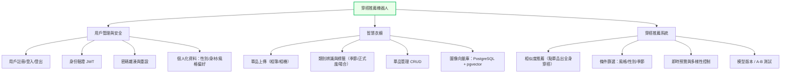
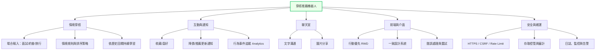
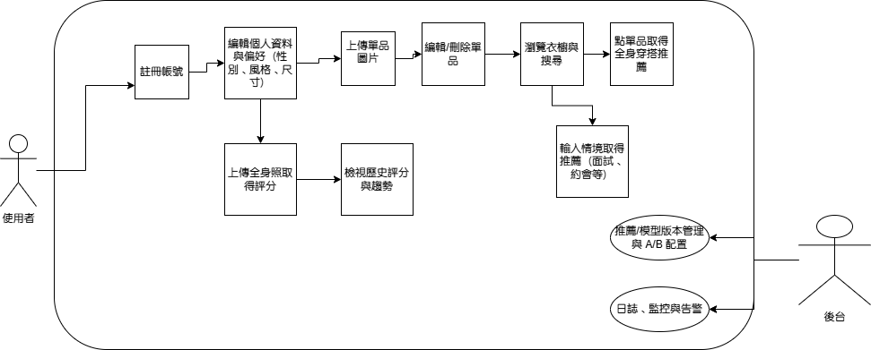

# 智慧穿搭推薦機器人

## 功能性需求

### 1. 用戶與身份
- 註冊、登入、登出；密碼雜湊與 Token 驗證（JWT）。
- 個人化屬性維護：性別、身材數值、偏好風格、場合偏好等。
- 相簿/相機權限取得與圖片上傳流程。

### 2. 智慧衣櫥
- 單品上傳與類別辨識；支援標籤（季節、正式度、場合）。
- 點擊衣櫃單品時，顯示相似的全身穿搭推薦。
- 以 PostgreSQL + pgvector 建立圖像向量資料庫，支援相似度檢索與近鄰查詢。

### 3. 情境穿搭推薦
- 使用者輸入場景（面試、約會、旅行等），系統產生搭配建議。:
- 提供條件篩選：風格、性別、季節與圖片顯示控制。
- 依情境與歷史互動動態調整排序與多樣性。

### 4. 穿搭評分與建議
- 上傳全身穿搭照，系統回傳整體分數與改善建議文字。
- 保留評分歷史，支援版本與模型標記。

### 5. 前端互動與 UI
- 即時預覽與結果回饋（喜歡/不喜歡、收藏、分享）。  
- 行動優先的版面與一致的設計系統；持續美化 UI。
- 圖像清單、卡片式詳情、篩選器與搜尋框。

### 6. 系統與資料
- 事件追蹤（推薦點擊、停留、轉換）。
- 管理介面：單品維護、模型版本切換、特徵向量重建。
- 批次匯入/匯出：單品、標籤、向量索引備份。

---

## 非功能性需求
### 1. 效能
- 首屏與主要列表／搜尋回應 ≤ 3 秒（P95）。
- 圖像相似度檢索或評分推論 ≤ 10 秒（P95）。
- 向量庫可擴充至 10^5～10^6 筆，召回與延遲線性外的劣化需受控（可採 IVF/IVF+PQ/HNSW）。

### 2. 可用性與可及性
- 首次導覽能在 3 分鐘內完成「上傳單品 → 取得推薦」閉環。
- 錯誤訊息明確，含重試、離線提示與回退策略。
- AA 等級可及性要點：鍵盤可用、替代文字、對比度。

### 3. 安全與隱私
- 全站 HTTPS；JWT/Session 與 CSRF 防護；Rate Limiting 與 IP 檢測。
- 影像與個資僅授權使用者可存取；支援刪除請求與存留週期。
- 模型與向量資料具備存取控管與審計軌跡。

---

# 功能分解圖

# 使用案例圖

## 使用案例 1：上傳衣物建立智慧衣櫥
**主要角色**：使用者（User）  
**目標**：讓使用者能管理個人衣櫥並作為推薦依據。  

**主要流程**：
1. 使用者登入系統。  
2. 上傳單件衣物圖片（拍照或從相簿選擇）。  
3. 系統進行圖像辨識與分類（衣服、褲子、鞋子、配件等）。  
4. 使用者可手動修正分類與新增標籤（如風格、季節）。  
5. 系統將結果存入智慧衣櫥資料庫（pgvector 特徵向量建立）。  

**替代流程**：
- 若圖像辨識失敗，系統提示使用者手動輸入資訊。  

---

## 使用案例 2：AI 穿搭推薦與評分
**主要角色**：使用者（User）  
**目標**：依據上傳單品或情境產生完整穿搭建議並給出 AI 評分。  

**主要流程**：
1. 使用者從衣櫥中點選一件單品或輸入場合（如面試）。  
2. 系統從資料庫中查找相似單品組合並生成穿搭建議。  
3. 顯示完整穿搭圖片與細節（風格、顏色搭配等）。  
4. 使用者可上傳全身照，由系統給出穿搭評分與建議文字。  

**替代流程**：
- 若資料不足，系統提示需補充更多衣物圖片以提升推薦準確度。  

---

## 使用案例 3：互動通知與收藏管理
**主要角色**：使用者（User）  
**次要角色**：系統（System）  
**目標**：提供個人化通知與收藏管理。  

**主要流程**：
1. 使用者將喜歡的穿搭加入收藏清單。  
2. 系統監測使用者喜好並推送相似推薦。  
3. 若有穿搭或單品價格變動（如合作商家），系統推播通知。  
4. 使用者可在通知中心查看變動紀錄與新推薦結果。  

**替代流程**：
- 若使用者關閉通知功能，系統不再推送提醒。  

