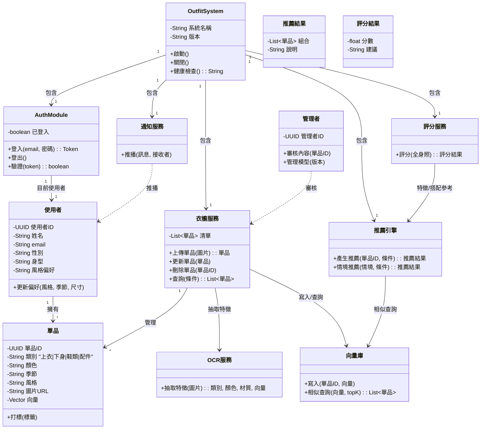
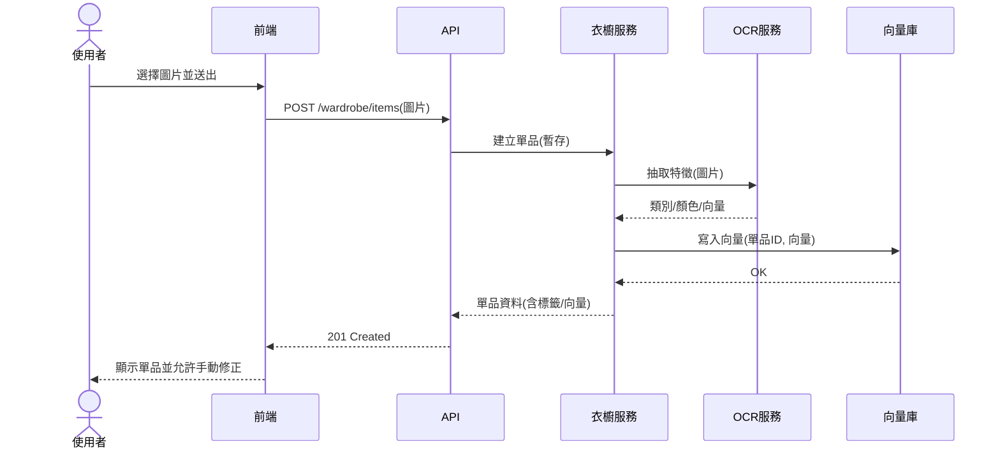
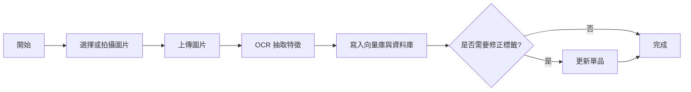
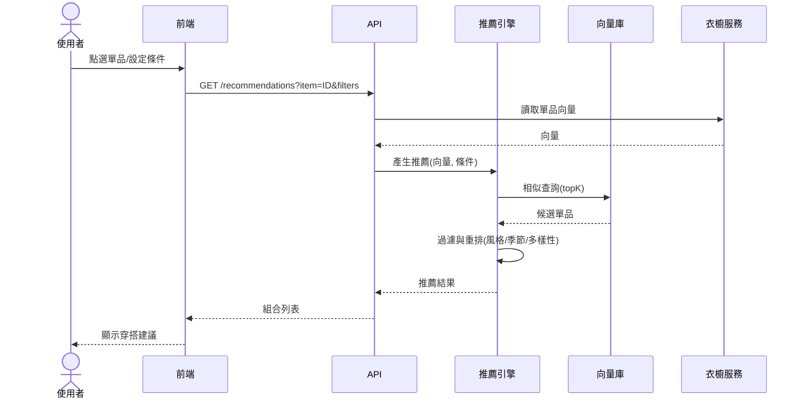
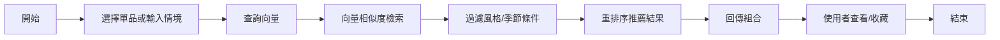
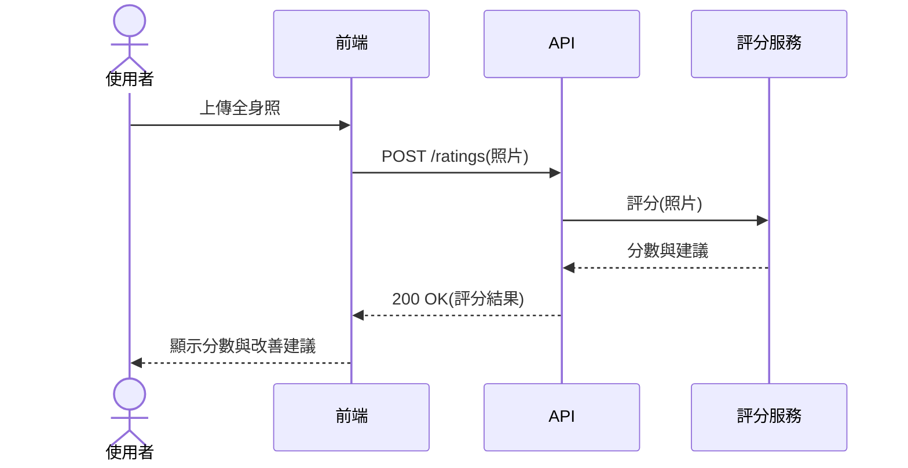
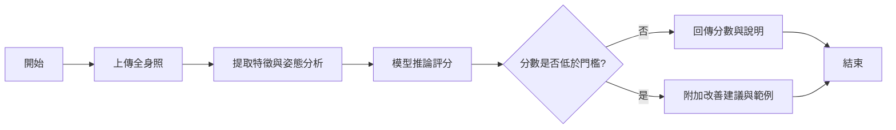

# UML 類別圖

```mermaid
classDiagram
%% ========== 主系統與核心模組 ==========
class OutfitSystem {
    -String 系統名稱
    -String 版本
    +啟動()
    +關閉()
    +健康檢查(): String
}

class AuthModule {
    -boolean 已登入
    +登入(email, 密碼): Token
    +登出()
    +驗證(token): boolean
}

class 使用者 {
    -UUID 使用者ID
    -String 姓名
    -String email
    -String 性別
    -String 身型
    -String 風格偏好
    +更新偏好(風格, 季節, 尺寸)
}

class 衣櫥服務 {
    -List~單品~ 清單
    +上傳單品(圖片): 單品
    +更新單品(單品)
    +刪除單品(單品ID)
    +查詢(條件): List~單品~
}

class 單品 {
    -UUID 單品ID
    -String 類別  "上衣|下身|鞋類|配件"
    -String 顏色
    -String 季節
    -String 風格
    -String 圖片URL
    -Vector 向量
    +打標(標籤)
}

class 推薦引擎 {
    +產生推薦(單品ID, 條件): 推薦結果
    +情境推薦(情境, 條件): 推薦結果
}

class 評分服務 {
    +評分(全身照): 評分結果
}

class 通知服務 {
    +推播(訊息, 接收者)
}

class 向量庫 {
    +寫入(單品ID, 向量)
    +相似查詢(向量, topK): List~單品~
}

class OCR服務 {
    +抽取特徵(圖片): 類別, 顏色, 材質, 向量
}

class 推薦結果 {
    -List~單品~ 組合
    -String 說明
}

class 評分結果 {
    -float 分數
    -String 建議
}

class 管理者 {
    -UUID 管理者ID
    +審核內容(單品ID)
    +管理模型(版本)
}

%% ========== 關聯 ==========
OutfitSystem "1" --> "1" AuthModule : 包含
OutfitSystem "1" --> "1" 衣櫥服務 : 包含
OutfitSystem "1" --> "1" 推薦引擎 : 包含
OutfitSystem "1" --> "1" 評分服務 : 包含
OutfitSystem "1" --> "1" 通知服務 : 包含

AuthModule "1" --> "1" 使用者 : 目前使用者
使用者 "1" --> "*" 單品 : 擁有
衣櫥服務 "1" --> "*" 單品 : 管理
衣櫥服務 --> OCR服務 : 抽取特徵
衣櫥服務 --> 向量庫 : 寫入/查詢
推薦引擎 --> 向量庫 : 相似查詢
評分服務 --> 推薦引擎 : 特徵/搭配參考
通知服務 ..> 使用者 : 推播
管理者 ..> 衣櫥服務 : 審核
```

# 使用案例的循序圖與活動圖

## 使用案例 1：上傳衣物建立智慧衣櫥
* ### 循序圖

```mermaid
   sequenceDiagram
actor 使用者
participant 前端
participant API
participant 衣櫥 as 衣櫥服務
participant OCR as OCR服務
participant Vec as 向量庫

使用者->>前端: 選擇圖片並送出
前端->>API: POST /wardrobe/items(圖片)
API->>衣櫥: 建立單品(暫存)
衣櫥->>OCR: 抽取特徵(圖片)
OCR-->>衣櫥: 類別/顏色/向量
衣櫥->>Vec: 寫入向量(單品ID, 向量)
Vec-->>衣櫥: OK
衣櫥-->>API: 單品資料(含標籤/向量)
API-->>前端: 201 Created
前端-->>使用者: 顯示單品並允許手動修正
```

* ### 活動圖

```mermaid
flowchart LR
A[開始] --> B[選擇或拍攝圖片]
B --> C[上傳圖片]
C --> D[OCR 抽取特徵]
D --> E[寫入向量庫與資料庫]
E --> F{是否需要修正標籤?}
F -- 是 --> G[更新單品]
F -- 否 --> H[完成]
G --> H
```

## 使用案例 2：點單品取得推薦
* ### 循序圖

```mermaid
sequenceDiagram
actor 使用者
participant 前端
participant API
participant 引擎 as 推薦引擎
participant Vec as 向量庫
participant 衣櫥 as 衣櫥服務

使用者->>前端: 點選單品/設定條件
前端->>API: GET /recommendations?item=ID&filters
API->>衣櫥: 讀取單品向量
衣櫥-->>API: 向量
API->>引擎: 產生推薦(向量, 條件)
引擎->>Vec: 相似查詢(topK)
Vec-->>引擎: 候選單品
引擎->>引擎: 過濾與重排(風格/季節/多樣性)
引擎-->>API: 推薦結果
API-->>前端: 組合列表
前端-->>使用者: 顯示穿搭建議
```

* ### 活動圖

```mermaid
flowchart LR
A[開始] --> B[選擇單品或輸入情境]
B --> C[查詢向量]
C --> D[向量相似度檢索]
D --> E[過濾風格/季節條件]
E --> F[重排序推薦結果]
F --> G[回傳組合]
G --> H[使用者查看/收藏]
H --> I[結束]
```

## 使用案例 3：上傳全身照取得評分
* ### 循序圖

```mermaid
sequenceDiagram
actor 使用者
participant 前端
participant API
participant 評分 as 評分服務

使用者->>前端: 上傳全身照
前端->>API: POST /ratings(照片)
API->>評分: 評分(照片)
評分-->>API: 分數與建議
API-->>前端: 200 OK(評分結果)
前端-->>使用者: 顯示分數與改善建議
```

* ### 活動圖

```mermaid
flowchart LR
A[開始] --> B[上傳全身照]
B --> C[提取特徵與姿態分析]
C --> D[模型推論評分]
D --> E{分數是否低於門檻?}
E -- 否 --> F[回傳分數與說明]
E -- 是 --> G[附加改善建議與範例]
F --> H[結束]
G --> H
```
