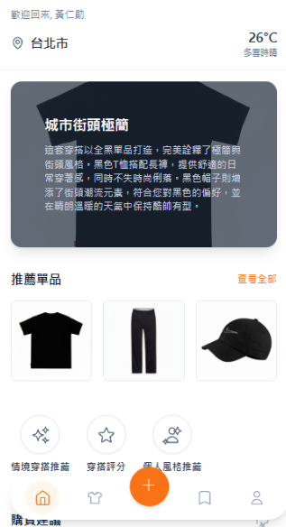
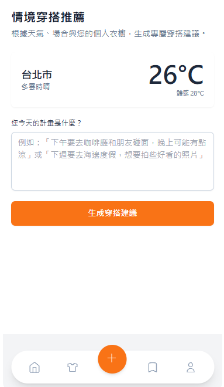
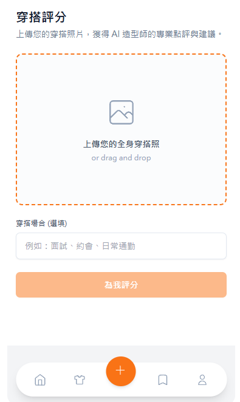
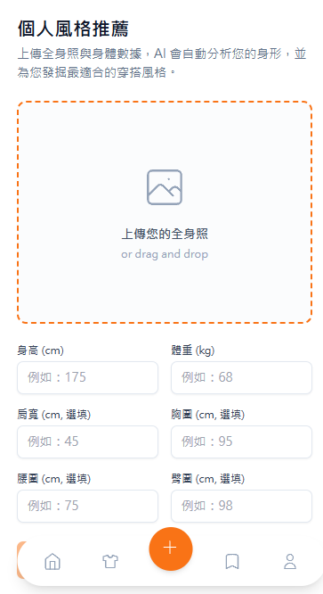
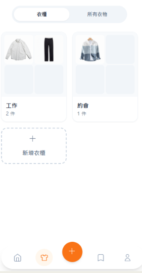
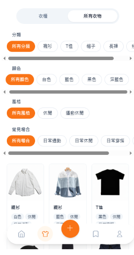

## 介面與功能展示

### 主頁
  
提供整體入口，整合主要功能模組。使用者可從此快速進入穿搭推薦、風格分析與智慧衣櫥。

### 功能一：穿搭推薦
  
依據場合、風格、氣溫等條件自動生成穿搭建議，並基於服裝特徵與搭配邏輯進行最佳化選擇。

### 功能二：穿搭評分
  
上傳穿搭後，系統根據配色、風格一致性、版型協調度等指標給出評分與改善建議。

### 功能三：個人風格推薦
  
分析使用者歷史穿搭與偏好，推算個人風格傾向，提供個人化推薦方向。

### 智慧衣櫥
    
整合衣物資訊，呈現服飾分類、穿搭紀錄與使用頻率，並提供多視角瀏覽以提升衣櫥管理效率。
