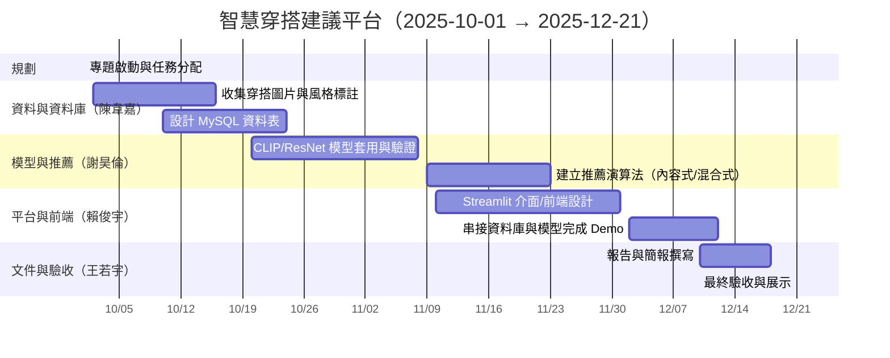
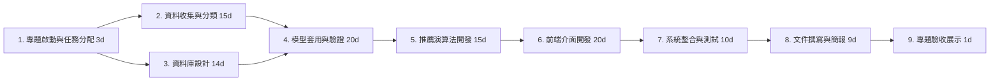

## 👥 組員分工

### 資料收集與資料庫設計  
**負責人：陳韋嘉**  
- 蒐集穿搭圖片並建立風格分類資料庫  
- 設計 MySQL 資料表結構與關聯  
- 整理資料標籤（類別、顏色、風格、場合等）  

---

### AI 模型應用與推薦系統  
**負責人：謝昊倫**  
- 使用 **CLIP / ResNet** 模型進行圖片特徵提取與分類  
- 設計穿搭推薦演算法（內容式 / 混合式）  
- 建立模型訓練流程與推論介面  

---

### 平台開發與前端呈現  
**負責人：賴俊宇**  
- 建立使用者介面
- 整合資料庫與 AI 模型，完成前後端互動 Demo  
- 優化使用者體驗與操作流程  

---

### 文件編寫與簡報製作
**負責人：王若宇**  
- 撰寫專題報告與技術文件  
- 製作期末簡報與展示內容  

